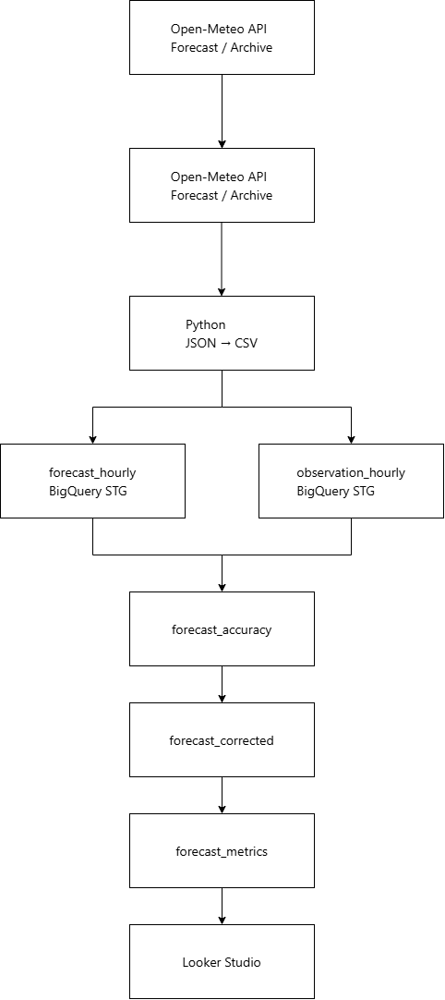

# 気象データ同化基盤構築（GCP・BigQuery活用）

## 概要

Open-Meteo APIから取得した気象予報データおよび観測データを活用し、
GCP上にデータレイクとDWHを構築しました。

Cloud Storageに蓄積した生データをBigQueryへ取り込み、
予報値と実測値の誤差分析および予測補正（データ同化）を実施しました。

また、Looker Studioによる可視化基盤を構築し、
予測精度を継続的に評価できる環境を整備しました。

---

## 使用技術

### クラウド

- Google Cloud Platform (GCP)
- BigQuery
- Cloud Storage

### 言語

- Python
- SQL

### API

- Open-Meteo Forecast API
- Open-Meteo Archive API

### BIツール

- Looker Studio

### その他

- Git
- GitHub

---

## 自動化

Cloud FunctionsおよびCloud Schedulerを利用し、気象データ収集を自動化しました。

### 自動収集フロー

Cloud Scheduler
↓
Cloud Functions
↓
Open-Meteo API
↓
Cloud Storage
↓
BigQuery
↓
Looker Studio

### 実施内容

- Cloud Schedulerによる定期実行
- Cloud Functionsによるサーバレス処理
- Open-Meteo APIからの自動データ取得
- Cloud Storageへの自動保存


## システム構成

Open-Meteo API
↓
Cloud Storage（Data Lake）
↓
BigQuery STG
↓
BigQuery MART
↓
Looker Studio




## データモデル

### STG

#### forecast_hourly

予報データを格納するテーブル

| カラム名 | 型 | 説明 |
|----------|----|------|
| time | TIMESTAMP | 予報対象日時 |
| temperature_2m | FLOAT64 | 予測気温(℃) |

#### observation_hourly

観測データを格納するテーブル

| カラム名 | 型 | 説明 |
|----------|----|------|
| time | TIMESTAMP | 観測日時 |
| temperature_2m | FLOAT64 | 実測気温(℃) |

### MART

#### forecast_accuracy

予報値と実測値を比較する誤差分析テーブル

| カラム名 | 型 | 説明 |
|----------|----|------|
| time | TIMESTAMP | 対象日時 |
| forecast_temp | FLOAT64 | 予測気温 |
| actual_temp | FLOAT64 | 実測気温 |
| error | FLOAT64 | 実測値 - 予測値 |

#### forecast_corrected

補正後予測値を格納するテーブル

| カラム名 | 型 | 説明 |
|----------|----|------|
| time | TIMESTAMP | 対象日時 |
| forecast_temp | FLOAT64 | 予測気温 |
| corrected_temp | FLOAT64 | 補正後予測気温 |
| actual_temp | FLOAT64 | 実測気温 |

#### forecast_metrics

予測精度評価指標を格納するテーブル

| カラム名 | 型 | 説明 |
|----------|----|------|
| mae | FLOAT64 | 平均絶対誤差 |
| rmse | FLOAT64 | 二乗平均平方根誤差 |
| bias | FLOAT64 | 平均誤差 |

---

## データ処理フロー

1. Open-Meteo Forecast APIから予報データを取得
2. Open-Meteo Archive APIから観測データを取得
3. JSON形式でCloud Storageへ保存
4. PythonによりCSV形式へ変換
5. BigQuery STGテーブルへロード
6. 予報値と実測値を結合
7. 誤差分析テーブルを作成
8. 平均誤差を利用して予測補正を実施
9. MAE・RMSE・BIASを算出
10. Looker Studioで可視化

---

## 予測補正ロジック

予報値と実測値の平均誤差（BIAS）を利用し、予測値の補正を実施しました。

### 算出式

```text
error = actual_temp - forecast_temp
```

```text
bias = AVG(error)
```

```text
corrected_temp = forecast_temp + bias
```

### 補正イメージ

```text
予測気温 : 25.0℃
平均誤差 : +1.2℃

補正後予測気温 : 26.2℃
```

---

## 精度評価指標

本プロジェクトでは予測精度の評価のため、以下の指標を使用しました。

### MAE（Mean Absolute Error）

平均絶対誤差

```text
MAE = AVG(ABS(error))
```

特徴

- 解釈しやすい
- 外れ値の影響を受けにくい

### RMSE（Root Mean Squared Error）

二乗平均平方根誤差

```text
RMSE = SQRT(AVG(error²))
```

特徴

- 大きな誤差を重視できる
- 気象予測評価でよく利用される

### BIAS

平均誤差

```text
BIAS = AVG(error)
```

特徴

- 予測が高めか低めかを確認できる

---

## ダッシュボード

Looker Studioを利用し、予測精度評価ダッシュボードを作成しました。

### 気温比較

表示項目

- Forecast Temperature
- Actual Temperature
- Corrected Temperature

可視化

- 時系列折れ線グラフ

目的

- 補正前後の予測精度比較

### 誤差分析

表示項目

- Error

可視化

- 時系列グラフ
- 棒グラフ

目的

- 誤差の発生傾向分析

### KPI

表示項目

- MAE
- RMSE
- BIAS

可視化

- スコアカード

目的

- 予測精度の定量評価

---

## プロジェクト成果

### 技術面

- GCP上に気象データ分析基盤を構築
- Cloud Storageを利用したデータレイク環境を構築
- BigQueryによるSTG/MART構成のDWHを設計
- Open-Meteo APIを利用したデータ取得処理を実装
- PythonによるETL処理を実装
- SQLによる誤差分析を実施
- データ同化を模した予測補正ロジックを構築
- Looker Studioによる可視化基盤を構築

### 分析面

- 予測値と実測値の比較分析を実施
- MAE・RMSE・BIASによる精度評価を実施
- 補正後予測値による予測改善効果を確認

---

## 工夫した点

- Cloud StorageとBigQueryを組み合わせたデータレイク/DWH構成を採用
- RAW・STG・MARTを意識したデータモデリングを実施
- APIから取得したネスト構造JSONをCSVへ変換し分析可能な形式へ整形
- データ同化をイメージした補正ロジックを実装
- BIツールによる可視化まで一貫して実施

---

## 今後の改善

- Cloud Functionsによるデータ取得自動化
- Cloud Schedulerによる定期実行
- 複数観測地点への対応
- 湿度・降水量・風速の分析追加
- 機械学習モデルによる予測補正
- BigQueryパイプラインの自動化
- データ品質監視機能の追加